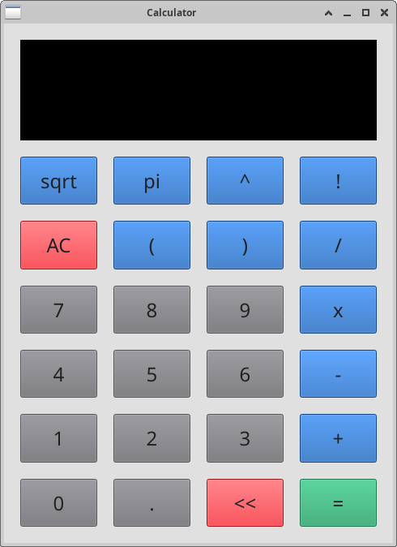

# Build
First you have to install CMake and Qt libraries required by GUI mode.
If you want to isolate building environment from your host OS, then
you can use docker for that process.

## Host OS - Visual Studio Code:
- Configure (will generate proper Makefile):
```bash
Ctrl + Shift + P
> Type: "Run Task"
> Select: "CMake Configure [<Type of build>]
```
- Build (will create execution binary):
```bash
Ctrl + Shift + P
> Type: "Run Task"
> Select: "CMake Build [<Type of build>]
```
By default "Debug" type of build is set, key sequence: `Ctrl + Shift + B` will rebuild "Debug" version.

## Host OS - CMake:
To configure and build try following commands:
```bash
cmake -S . -B ./build/debug -DCMAKE_BUILD_TYPE=Debug"
cmake --build ./build/debug" --config "Debug"
```

## Ubunt 24.04 - Docker:
For ubuntu on x64 arch, isolated environment for builds were
added. First install docker regarding to the official instruction,
for instance: see [Ubuntu instraction](https://docs.docker.com/engine/install/ubuntu/), then execute following command:
```bash
sudo docker build \
    --build-arg QT_USERNAME=<email-used-for-qt-registration> \
    --build-arg QT_PASSWORD=<password-used-for-qt-registration> \
    -f Dockerfile.build --output type=local,dest=./ .
```
built binaries will be available in `artifacts` directory.

# Run
Build artifacts are available in following directory:
```bash
./build/<build_type>/bin/
```
where `<build_type>` could be `debug` or `release`.
All information needed to properly execute calculator app can be displayed on `--help` / `-h` command

## GUI mode
To run:
```bash
./calculator -u
```
This will display GUI:

<div>
    <p align="center" width="100%">
        
    </p>
</div>

## execution mode
To run and execute expression type:
```bash
./calculator -e <expression>;
```
for example:
```bash
./calculator -e "(1+2)*3;"
```
Don't forget about the last sign `;`, it's needed to mark the end of expression, if the sign won't be provided
calcualtor will still wait for more tokens to process as a part of provided expression.

## interactive mode
To run:
```bash
./calculator -i
```
This will display the prompt and wait until user provide expression to evaluate, and confirm it with
<ENTER> key, for instance:
```bash
Launching calculator in interactive mode.
Enter expression (or q to quit):
> (1+2)*3;
= 9
> q
Exiting calculator.
```
